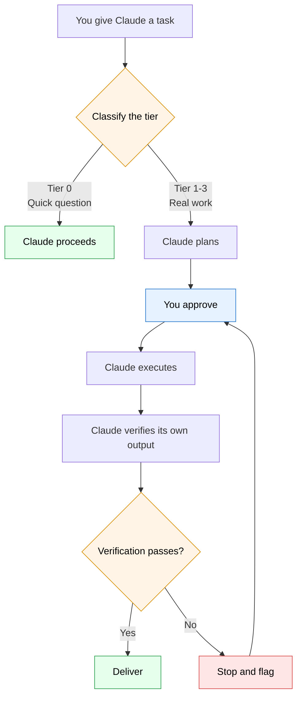

# AI Employee Kit

Kit v0.2.0 · Built on AI Governance Protocol v2.0 · Tracks ai-governance-standards v5.2.0

A governance protocol that makes AI assistants (Claude) more careful, reliable, and predictable.

## What This Does

When installed, Claude will:

- **Plan before acting.** Claude states what it will do and waits for your approval before making changes.
- **Verify before delivering.** Claude checks its own work, confirms counts match, and flags anything uncertain.
- **Follow safety rules.** Seven non-negotiable rules prevent Claude from deleting data, skipping steps, or making unauthorized changes.
- **Produce session summaries.** At the end of every working session, Claude writes up what was done, what is left, and what the next person needs to know.

## Quick Start

1. Go to [claude.ai](https://claude.ai) and open or create a Project.
2. Open **Project Settings** and find the **Project Instructions** field.
3. Copy the entire contents of `GOVERNANCE-SKILL.md` and paste it into the Project Instructions field.

That is it. Claude will now follow the governance protocol in every conversation within that project.

For other setup options (standalone chat, or a pointer to the upstream Claude Code CLI harness), see [INSTALL-GUIDE.md](INSTALL-GUIDE.md).

## What's In the Kit

| File | Description |
|------|-------------|
| `GOVERNANCE-SKILL.md` | The governance protocol itself. Paste this into Claude's project instructions. |
| `INSTALL-GUIDE.md` | Setup guide covering Claude.ai Projects, standalone chat, and a pointer to the upstream Claude Code CLI harness. |
| `QUICK-REFERENCE.md` | One-page cheat sheet of the 9 governance steps and 7 safety rules. |
| `ABOUT-TEMPLATE.md` | Template for adding your company context so Claude understands your business. |
| `CONTRIBUTING.md` | Guide for contributors: scanner usage, counselor-review expectations for rule changes. |
| `SECURITY.md` | Security policy. Directs vulnerability reports to GitHub Security Advisories. |
| `CHANGELOG.md` | Release notes. |
| `VERSION` | Tracks the kit version. |
| `bin/check-contamination.sh` + `bin/denylist.txt` | Standalone contamination scanner and token denylist. Runs locally or in CI. |
| `.github/workflows/denylist.yml` | CI workflow that runs the contamination scanner on every push and PR. |

## How It Works

The picture above is the whole protocol in one pass. The 7 safety rules run underneath every step; they do not appear as nodes because they are always on.

### Tier Classification

Every task gets classified before Claude starts working:

- **Tier 0 (Casual):** Quick questions and brainstorming. No overhead.
- **Tier 1 (Standard):** Single deliverable with clear scope. Claude plans, you approve, Claude executes.
- **Tier 2 (Complex):** Multi-step or multi-file work. Full planning, chunk-by-chunk execution, and review.
- **Tier 3 (Critical):** Financial, legal, or public-facing work. Maximum verification with three independent review passes.

### The 7 Safety Rules

These are always active and non-negotiable:

- **R1:** Never touch the original. Work on copies.
- **R2:** All or nothing. Multi-step work either all succeeds or all gets flagged.
- **R3:** Validate inputs before processing.
- **R4:** Guard every assumption. Verify before acting.
- **R5:** Keep related things in sync. Both happen now, never "later."
- **R6:** Know the undo. If irreversible, get explicit approval first.
- **R7:** Human always has final say. Claude recommends, you decide.

### Plan-Before-Execute Flow

For any task above Tier 0, Claude will:

1. Tell you what it found and what it understands about the current state.
2. Present a step-by-step plan, including what it will NOT touch.
3. Wait for your explicit approval before doing any work.
4. Verify its output before delivering.

## Customization

Use `ABOUT-TEMPLATE.md` to give Claude your company context. Fill in your company name, industry terms, business rules, and preferences. Paste the completed template into your project or conversation so Claude can tailor its work to your organization.

## Advanced Setup

This kit ships the governance protocol doc, the ABOUT template, the quick reference, and a standalone contamination scanner. It does not ship the Claude Code hook harness.

Teams using Claude Code CLI who want the full automated harness (session-start gates, tool call counting, multi-session chaining, secret scrubbing, path guards, retrospective gates) should install from the upstream repository: [strategicthings/ai-governance-standards](https://github.com/strategicthings/ai-governance-standards). That repo is the canonical source for the hook harness and is tracked by this kit's VERSION.

The contamination scanner in `bin/` runs standalone. Invoke `bash bin/check-contamination.sh` locally, or rely on the CI workflow to run it on every push and PR.

## License

MIT. See [LICENSE](LICENSE).
